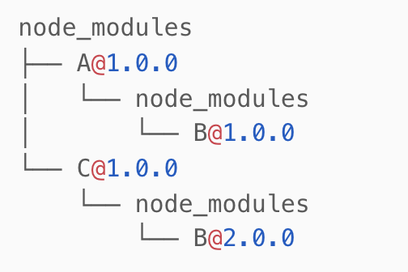
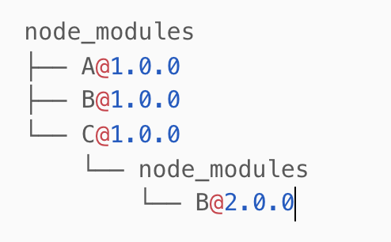
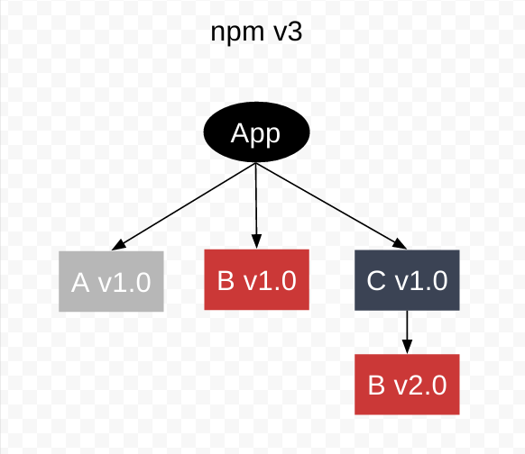
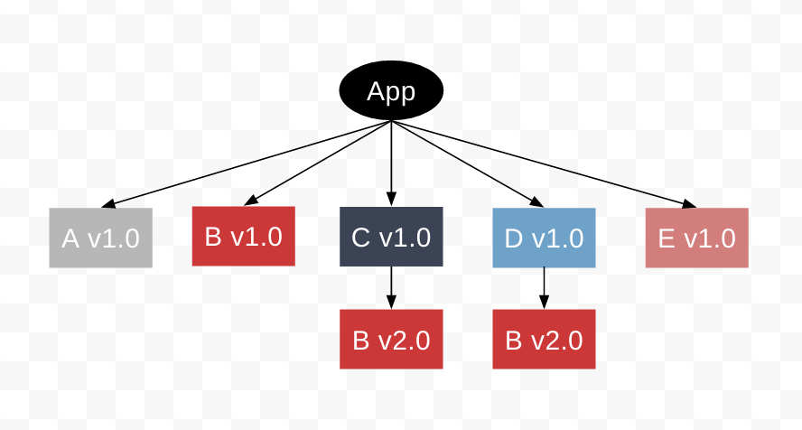
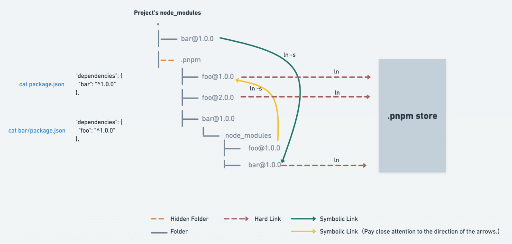

现在越来越多的框架开始使用pnpm作为首选的支持，放到了比npm、yarn更优先的位置，那么来看下pnpm解决了什么问题

## pnpm的优势

1. **节省磁盘空间**：pnpm使用硬链接的方式共享已安装的包，所有的包都保存在公共的store种，不会出现一个很简单的项目 node_modules 拉了2个G的情况
2. **更快的安装速度**：使用过的包就不会重新下载；依赖解析、目录结构计算、链接依赖的过程并发进行，速度更快
3. **防止越权访问**：使用 npm 或 Yarn Classic 安装依赖项时，所有的包都被提升到模块目录的根目录。 这样就导致了一个问题，源码可以直接访问和修改依赖，而不是作为只读的项目依赖；pnpm 使用符号链接将项目的直接依赖项添加到模块目录的根目录中

## 包管理工具发展史

### npm v1/v2 依赖嵌套

npm最早的版本中使用了很简单的嵌套模式进行依赖管理。比如我们在项目中依赖了A模块和C模块，而A模块和C模块依赖了不同版本的B模块，此时生成的node_modules目录如下：



可以看到这种是嵌套的node_modules结构，每个模块的依赖下面还会存在一个 node_modules 目录来存放模块依赖的依赖。这种方式虽然简单明了，但存在一些比较大的问题。如果我们在项目中增加一个同样依赖2.0版本B的模块D，此时生成的node_modules目录便会如下所示。虽然模块A、D依赖同一个版本B，但B却重复下载安装了两遍，造成了重复的空间浪费。这便是依赖地狱问题。

### npm v3 扁平化

npm v3完成重写了依赖安装程序，npm3通过扁平化的方式将子依赖项安装在主依赖项所在的目录中（hoisting提升），以减少依赖嵌套导致的深层树和冗余。此时生成的node_modules目录如下：



为了确保模块的正确加载，npm也实现了额外的依赖查找算法，核心是递归向上查找node_modules。在安装新的包时，会不停往上级node_modules中查找。如果找到相同版本的包就不会重新安装，在遇到版本冲突时才会在模块下的 node_modules 目录下存放该模块子依赖，解决了大量包重复安装的问题，依赖的层级也不会太深。

扁平化的模式解决了依赖地狱的问题，但也带来了额外的新问题。

#### 幽灵依赖

幽灵依赖主要发生某个包未在package.json中定义，但项目中依然可以引用到的情况下。考虑之前的案例，它的package.json如右图所示。



在index.js中我们require B也是可以正常工作的，因为依赖被平铺了，这可能会导致意想不到的问题：

- 依赖不兼容：my-library库中并没有声明依赖B的版本，因此B的major更新对于SemVer体系是完全合法的，这就导致其他用户安装时可能会下载到与当前依赖不兼容的版本。
- 依赖缺失：我们也可以直接引用项目中devDepdency的子依赖，但其他用户安装时并不会devDepdency，这就可能导致运行时会立刻报错。

#### 多重依赖



考虑在项目中继续引入的依赖2.0版本B的模块D与而1.0版本B的模块E，此时无论是把B 2.0还是1.0提升放在顶层，都会导致另一个版本存在重复的问题，比如这里重复的2.0。此时就会存在以下问题：

- 破坏单例模式：模块C、D中引入了模块B中导出的一个单例对象，即使代码里看起来加载的是同一模块的同一版本，但实际解析加载的是不同的module，引入的也是不同的对象。如果同时对该对象进行副作用操作，就会产生问题。
- types冲突：虽然各个package的代码不会相互污染，但是他们的types仍然可以相互影响，因此版本重复可能会导致全局的types命名冲突。

#### 不确定性

在前端包管理的背景下，确定性指在给定package.json下，无论在何种环境下执行npm install命令都能得到相同的node_modules目录结构。然而npm v3是不确定性的，它node_modules目录以及依赖树结构取决于用户安装的顺序。

手动升级某个模块和全量的install的结果可能是不同的，会导致本地运行和发布环境的结果不一致

### npm v5 扁平化+lock

在npm v5中新增了package-lock.json。当项目有package.json文件并首次执行npm install安装后，会自动生成一个package-lock.json文件，该文件里面记录了package.json依赖的模块，以及模块的子依赖。并且给每个依赖标明了版本、获取地址和验证模块完整性哈希值。通过package-lock.json，保障了依赖包安装的确定性与兼容性，使得每次安装都会出现相同的结果。

### Yarn v2 Plug'n'Play

在Yarn 的2.x版本重点推出了Plug'n'Play（PnP）零安装模式，放弃了node_modules，更加保证依赖的可靠性，构建速度也得到更大的提升。

因为Node依赖于node_modules查找依赖，node_modules的生成会涉及到下载依赖包、解压到缓存、拷贝到本地文件目录等一系列重IO的操作，包括依赖查找以及处理重复依赖都是非常耗时操作，基于node_modules的包管理器并没有很多优化的空间。因此yarn反其道而行之，既然包管理器已经拥有了项目依赖树的结构，那也可以直接由包管理器通知解释器包在磁盘上的位置并管理依赖包版本与子依赖关系。

执行`yarn --pnp`模式即可开启PnP模式。在PnP模式，yarn 会生成 .pnp.cjs 文件代替node_modules。该文件维护了依赖包到磁盘位置与子依赖项列表的映射。同时 .pnp.js 还实现了resolveRequest方法处理require请求，该方法会直接根据映射表确定依赖在文件系统中的位置，从而避免了在node_modules查找依赖的 I/O 操作。

pnp模式优缺点也非常明显：

- 优：摆脱node_modules，安装、模块速度加载快；所有 npm 模块都会存放在全局的缓存目录下，避免多重依赖；严格模式下子依赖不会提升，也避免了幽灵依赖（但这可能会导致某些包出现问题，因此也支持了依赖提升的宽松模式:<）。
- 缺：自建resolver 处理Node require方法，执行Node文件需要通过yarn node解释器执行，脱离Node现存生态，兼容性不太好

### pnpm的解决方案

pnpm1.0于2017年正式发布，pnpm具有安装速度快、节约磁盘空间、安全性好等优点，它的出现也是为了解决npm和yarn存在的问题。

因为在基于npm或yarn的扁平化node_modules的结构下，虽然解决了依赖地狱、一致性与兼容性的问题，但多重依赖和幽灵依赖并没有好的解决方式。因为在不考虑循环依赖的情况下，实际的依赖结构图为有向无环图(DAG)，但是npm和yarn通过文件目录和node resolve算法模拟的实际上是有向无环图的一个超集（多出了很多错误祖先节点和兄弟节点之间的链接），这导致了很多的问题。pnpm也是通过硬链接与符号链接结合的方式，更加精确的模拟DAG来解决yarn和npm的问题。

#### 非扁平化的node_modules

**硬链接（hard link）**对一个文件进行修改，可能会影响到其他文件的内容，但是删除一个文件名，并不会影响其他文件名的访问

**符号链接（symlinks）**可以理解为快捷方式，pnpm在引用依赖时通过符号链接去找到对应磁盘目录（.pnpm）下的依赖地址

node_modules目录下没有node_modules，这是一个符号链接，实际真正的文件位于.pnpm目录中，这种嵌套node_modules结构的好处在于只有真正在依赖项中的包才能访问，避免了使用扁平化结构时所有被提升的包都可以访问，很好地解决了幽灵依赖的问题。此外，因为依赖始终都是存在store目录下的硬链接，相同的依赖始终只会被安装一次，多重依赖的问题也得到了解决。




## pnpm使用中的问题

- 不同应用的依赖是硬链接到同一份文件，如果在调试时修改了文件，有可能会无意中影响到其他项目

- 符号链接兼容性。存在符号链接不能适用的一些场景，比如 Electron 应用、部署在 lambda 上的应用无法使用 pnpm

- 是否有npm ci 类似的命令？

  `pnpm install --frozen-lockfile` 等同于 `npm ci`,而且这个选项在ci环境、生产环境会自动开启，无需额外配置

## pnpm基本使用

| 命令                            | 作用描述                                                     |
| :------------------------------ | ------------------------------------------------------------ |
| npm i pnpm -g                   | 安装pnpm                                                     |
| pnpm -v                         | 查看版本                                                     |
| pnpm add -g pnpm to update      | 升级版本                                                     |
| pnpm install                    | 安装项目依赖                                                 |
| pnpm run dev                    | 运行项目                                                     |
| pnpm add                        | 添加依赖                                                     |
| pnpm remove                     | 删除依赖                                                     |
| pnpm update                     | 更新依赖                                                     |
| pnpm import                     | 从另一个软件包管理器的 lock 文件生成 `pnpm-lock.yaml`，例如`package-lock.json` |
| pnpm list                       | 查看已安装的依赖                                             |
| pnpm why                        | 显示依赖于指定 `package`的所有 `package`                     |
| pnpm env use --global 16        | 使用制定版本的node.js                                        |
| pnpm env remove --global 14.0.0 | 移除指定版本的 Node.JS.                                      |
| pnpm env list                   | 列出本地或远程可用的 Node.js 版本                            |

以下是各版本 pnpm 与各版本 Node.js 之间的兼容表格

| Node.js    | pnpm 5 | pnpm 6 | pnpm 7 | pnpm 8 |
| ---------- | ------ | ------ | ------ | ------ |
| Node.js 12 | ✔️      | ✔️      | ❌      | ❌      |
| Node.js 14 | ✔️      | ✔️      | ✔️      | ❌      |
| Node.js 16 | 未知   | ✔️      | ✔️      | ✔️      |
| Node.js 18 | 未知   | ✔️      | ✔️      | ✔️      |
| Node.js 20 | 未知   | ?      | ✔️      | ✔️      |

## 其他可能得高级用法

- 配置`.npmrc`中的hoist、hoist-pattern，告诉 pnpm 哪些包应该被提升到 `node_modules/.pnpm/node_modules`。 默认情况下，所有包都被提升 —— 但是，如果您知道只有某些有缺陷的包具有幻影依赖，您可以使用此选项专门提升幻影依赖（推荐做法）

- 配置`.npmrc`中的registry，npm包注册源地址

- **别名(Aliases)**：假设你在项目中大量地使用了 `lodash`， 但 `lodash` 中的一个 bug 破坏了你的项目， 为此你修复了这个 bug，但 `lodash` 并没有合并（merge）它。 通常你会直接从你的 fork 仓库中安装修改过的 `lodash` (git 托管的依赖) 或者修改一下名称做为新包发布到 npm。 如果你使用第二种解决方式，则必须使用新的包名（`require('lodash')` => `require('awesome-lodash')`）来替换项目中的所有引用。 有了别名，你可以有第三种解决方式。

  发布一个名为 `awesome-lodash` 的新包，并使用 `lodash` 作为别名来安装它：

  ```text
  pnpm add lodash@npm:awesome-lodash
  ```

  

  不需要更改代码， 所有的 `lodash` 引用都被解析到了 `awesome-lodash`。

  有时你会想要在项目中使用一个包的两个不同版本， 很简单：

  ```sh
  pnpm add lodash1@npm:lodash@1
  pnpm add lodash2@npm:lodash@2
  ```

  

  现在，您可以通过 `require('lodash1')` 引入第一个版本的 lodash 并通过 `require('lodash2')` 引入第二个。


*参考资料*:

1. [pnpm 官方文档]( https://pnpm.js.org/en/)
2. [关于依赖管理的真相 — 前端包管理器探究](https://mp.weixin.qq.com/s?__biz=MzI5NjM5NDQxMg%3D%3D&mid=2247495463&idx=1&sn=591c5b3bfcf78f10c718153fe2dc8228#rd)
3. [为学习pnpm了解一点基础：软链接和硬链接](https://juejin.cn/post/7132275461467406366?searchId=202307311646020663406339E62FD6038B)


