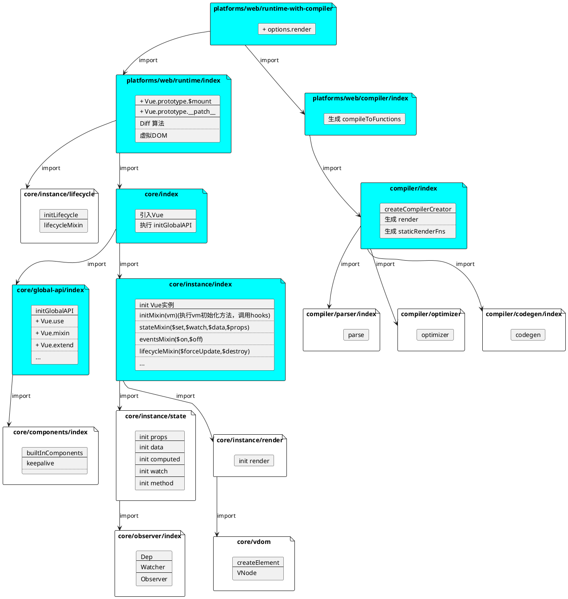

# 主线脉络



/src/platforms/web/runtime-with-compiler.js

```js
import config from 'core/config'
import { warn, cached } from 'core/util/index'
import { mark, measure } from 'core/util/perf'

import Vue from './runtime/index'
import { query } from './util/index'
import { compileToFunctions } from './compiler/index'
import {
  shouldDecodeNewlines,
  shouldDecodeNewlinesForHref
} from './util/compat'
import type { Component } from 'types/component'
import type { GlobalAPI } from 'types/global-api'

// 带缓存的 querySelector，返回内部的html字符串
const idToTemplate = cached(id => {
  const el = query(id)
  return el && el.innerHTML
})
console.log('runtime-with-compiler.ts-----1', Vue.prototype.$mount)
const mount = Vue.prototype.$mount
// 这一步是为了给实例加上render函数，core 模块中的 mountComponent 方法会调用实例的 render 函数生成虚拟节点
Vue.prototype.$mount = function (
  el?: string | Element, // 挂载的目标元素，例如 #app
  hydrating?: boolean // 服务端渲染相关的，客户端补水
): Component {
  el = el && query(el)

  /* istanbul ignore if */
  if (el === document.body || el === document.documentElement) {
    __DEV__ &&
      warn(
        `Do not mount Vue to <html> or <body> - mount to normal elements instead.`
      )
    return this
  }

  const options = this.$options
  console.log('runtime-with-compiler.ts-----2', options)
  // resolve template/el and convert to render function
  if (!options.render) {
    let template = options.template
    if (template) {
      if (typeof template === 'string') {
        if (template.charAt(0) === '#') {
          template = idToTemplate(template)
          console.log('runtime-with-compiler.ts-----3', template)
          /* istanbul ignore if */
          if (__DEV__ && !template) {
            warn(
              `Template element not found or is empty: ${options.template}`,
              this
            )
          }
        }
      } else if (template.nodeType) {
        template = template.innerHTML
      } else {
        if (__DEV__) {
          warn('invalid template option:' + template, this)
        }
        return this
      }
    } else if (el) {
      // @ts-expect-error
      template = getOuterHTML(el) // 获取元素的 outerHTML,html字符串
      console.log('runtime-with-compiler.ts-----4', template)
    }
    if (template) {
      /* istanbul ignore if */
      if (__DEV__ && config.performance && mark) {
        mark('compile')
      }
      // compileToFunctions 会将 template 编译成 render 函数
      const { render, staticRenderFns } = compileToFunctions(
        template,
        {
          outputSourceRange: __DEV__,
          shouldDecodeNewlines,
          shouldDecodeNewlinesForHref,
          delimiters: options.delimiters,
          comments: options.comments
        },
        this
      )
      options.render = render
      // 静态渲染函数,不会变动的部分
      options.staticRenderFns = staticRenderFns
      /* istanbul ignore if */
      if (__DEV__ && config.performance && mark) {
        mark('compile end')
        measure(`vue ${this._name} compile`, 'compile', 'compile end')
      }
    }
  }
  return mount.call(this, el, hydrating)
}

/**
 * Get outerHTML of elements, taking care
 * of SVG elements in IE as well.
 */
function getOuterHTML(el: Element): string {
  if (el.outerHTML) {
    return el.outerHTML
  } else {
    const container = document.createElement('div')
    container.appendChild(el.cloneNode(true))
    return container.innerHTML
  }
}

Vue.compile = compileToFunctions

export default Vue as GlobalAPI

```


platforms/web/runtime/index

```js
import Vue from 'core/index'
import config from 'core/config'
import { extend, noop } from 'shared/util'
import { mountComponent } from 'core/instance/lifecycle'
import { devtools, inBrowser } from 'core/util/index'

import {
  query,
  mustUseProp,
  isReservedTag,
  isReservedAttr,
  getTagNamespace,
  isUnknownElement
} from 'web/util/index'

import { patch } from './patch'
import platformDirectives from './directives/index'
import platformComponents from './components/index'
import type { Component } from 'types/component'

// install platform specific utils
Vue.config.mustUseProp = mustUseProp // 属性设置了必须用，例如option 的 selected 属性
Vue.config.isReservedTag = isReservedTag // 是否保留字
Vue.config.isReservedAttr = isReservedAttr
Vue.config.getTagNamespace = getTagNamespace
Vue.config.isUnknownElement = isUnknownElement // 是否未知元素

// install platform runtime directives & components
// 添加平台相关指令，例如 v-show
extend(Vue.options.directives, platformDirectives)
// 添加平台相关组件，例如 transition
extend(Vue.options.components, platformComponents)

// install platform patch function
// 原型上添加平台相关的方法补丁，web端的方法 例如：虚拟dom创建、diff算法、DOM更新等
Vue.prototype.__patch__ = inBrowser ? patch : noop

// public mount method
Vue.prototype.$mount = function (
  el?: string | Element,
  hydrating?: boolean
): Component {
  el = el && inBrowser ? query(el) : undefined
  return mountComponent(this, el, hydrating)
}

// devtools global hook
/* istanbul ignore next */
if (inBrowser) {
  setTimeout(() => {
    if (config.devtools) {
      if (devtools) {
        devtools.emit('init', Vue)
      } else if (__DEV__ && process.env.NODE_ENV !== 'test') {
        // @ts-expect-error
        console[console.info ? 'info' : 'log'](
          'Download the Vue Devtools extension for a better development experience:\n' +
            'https://github.com/vuejs/vue-devtools'
        )
      }
    }
    if (
      __DEV__ &&
      process.env.NODE_ENV !== 'test' &&
      config.productionTip !== false &&
      typeof console !== 'undefined'
    ) {
      // @ts-expect-error
      console[console.info ? 'info' : 'log'](
        `You are running Vue in development mode.\n` +
          `Make sure to turn on production mode when deploying for production.\n` +
          `See more tips at https://vuejs.org/guide/deployment.html`
      )
    }
  }, 0)
}

export default Vue

```

总结：补充了web的 指令、components方法、添加虚拟DOM相关的prototype.\_\_patch__、初始化\$mount

附带知识点：

- vue中，\$xxx(例如$emit,$on) 都是公共的实例方法，\_\_xx__(例如：\_\_patch__)表示内部方法，外部不应该访问该方法
- Vue.xx 和 Vue.prototype.xx 区别，例如 Vue.delete、Vue.use 和 Vue.prototype.\$emit、Vue.prototype.\$forceUpdate,前者和实例无关，更多是提供一些全局的方法，放在Vue上更容易找到，后者是跟实例强相关的，实例可直接调用。
- 有些方法 例如 Vue.nextTick Vue.prototype.$nextTick 实例和全局都可能要用到，方便使用两个地方都挂了，实现是同一个实现

core/global-api/index

```js
import config from '../config'
import { initUse } from './use'
import { initMixin } from './mixin'
import { initExtend } from './extend'
import { initAssetRegisters } from './assets'
import { set, del } from '../observer/index'
import { ASSET_TYPES } from 'shared/constants'
import builtInComponents from '../components/index'
import { observe } from 'core/observer/index'

import {
  warn,
  extend,
  nextTick,
  mergeOptions,
  defineReactive
} from '../util/index'
import type { GlobalAPI } from 'types/global-api'

export function initGlobalAPI(Vue: GlobalAPI) {
  // config
  const configDef: Record<string, any> = {}
  configDef.get = () => config
  if (__DEV__) {
    configDef.set = () => {
      warn(
        'Do not replace the Vue.config object, set individual fields instead.'
      )
    }
  }
  Object.defineProperty(Vue, 'config', configDef)

  // exposed util methods.
  // NOTE: these are not considered part of the public API - avoid relying on
  // them unless you are aware of the risk.
  Vue.util = {
    warn,
    extend,
    mergeOptions,
    defineReactive
  }

  Vue.set = set
  Vue.delete = del
  Vue.nextTick = nextTick

  // 2.6 explicit observable API
  Vue.observable = <T>(obj: T): T => {
    observe(obj)
    return obj
  }

  // 初始化 Vue.options 对象，并设置 Vue.options.components 为一个空对象
  Vue.options = Object.create(null)
  ASSET_TYPES.forEach(type => {
    Vue.options[type + 's'] = Object.create(null)
  })

  // this is used to identify the "base" constructor to extend all plain-object
  // components with in Weex's multi-instance scenarios.
  Vue.options._base = Vue

  extend(Vue.options.components, builtInComponents)

  // 注册 Vue.use() 方法
  initUse(Vue)
  // 注册 Vue.mixin() 方法
  initMixin(Vue)
  // 注册 Vue.extend() 方法
  initExtend(Vue)
  // 注册 Vue.component()、Vue.directive()、Vue.filter() 方法
  initAssetRegisters(Vue)
}

```

总结：这个代码比较短，没有总结，直接看代码注释

## /compiler/index

```js
import { parse } from './parser/index'
import { optimize } from './optimizer'
import { generate } from './codegen/index'
import { createCompilerCreator } from './create-compiler'
import { CompilerOptions, CompiledResult } from 'types/compiler'

// `createCompilerCreator` allows creating compilers that use alternative
// parser/optimizer/codegen, e.g the SSR optimizing compiler.
// Here we just export a default compiler using the default parts.
export const createCompiler = createCompilerCreator(function baseCompile(
  template: string,
  options: CompilerOptions
): CompiledResult {
  // parse 会将 template 转换成 AST
  const ast = parse(template.trim(), options)
  if (options.optimize !== false) {
    // 优化抽象语法树,例如添加静态标记
    optimize(ast, options)
  }
  // 生成代码
  const code = generate(ast, options)
  // 生成了抽象语法树，render函数，静态render函数
  return {
    ast,
    render: code.render,
    staticRenderFns: code.staticRenderFns
  }
})

```

总结：主要是 parse 会将 template 转换成 AST、optimize 优化抽象语法树,例如添加静态标记、generate 生成代码

附带知识点：

- 这里发现staticRenderFns总是[],研究了下，使用v-once或者节点是静态切包含静态children时会被标记staticRoot，此时 staticRenderFns 就有值了

