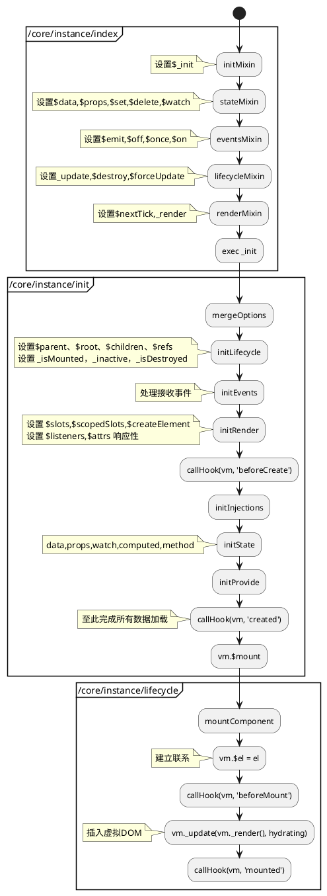

# vue实例化

```plantuml

@startuml
start
partition "/core/instance/index" {
:initMixin;
note
设置$_init
end note
:stateMixin;
note
设置$data,$props,$set,$delete,$watch
end note
:eventsMixin;
note
设置$emit,$off,$once,$on
end note
:lifecycleMixin;
note
设置_update,$destroy,$forceUpdate
end note
:renderMixin;
note
设置$nextTick,_render
end note
:exec _init;
}
partition "/core/instance/init" {
:mergeOptions;
:initLifecycle;
note
设置$parent、$root、$children、$refs
设置 _isMounted，_inactive，_isDestroyed
end note
:initEvents;
note
处理接收事件
end note
:initRender;
note
设置 $slots,$scopedSlots,$createElement
设置 $listeners,$attrs 响应性
end note
:callHook(vm, 'beforeCreate');
:initInjections;
:initState;
note
data,props,watch,computed,method
end note
:initProvide;
:callHook(vm, 'created');
note
至此完成所有数据加载
end note
:vm.$mount;
}
partition "/core/instance/lifecycle" {
:mountComponent;
:vm.$el = el;
note
建立联系
end note
:callHook(vm, 'beforeMount');
:vm._update(vm._render(), hydrating);
note
插入虚拟DOM
end note
:callHook(vm, 'mounted');
}
@enduml

```
