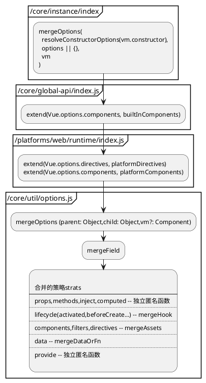

# vue实例化过程-options合并

```plantuml

@startuml

partition "/core/instance/index" {
    :mergeOptions(
    resolveConstructorOptions(vm.constructor),
    options || {},
    vm
  );
}

partition "/core/global-api/index.js" {
    :extend(Vue.options.components, builtInComponents);
}

partition "/platforms/web/runtime/index.js" {
    :extend(Vue.options.directives, platformDirectives)
    extend(Vue.options.components, platformComponents);
}

partition "/core/util/options.js" {
    :mergeOptions (parent: Object,child: Object,vm?: Component);
    :mergeField;
    :
    合并的策略strats
    ----
    props,methods,inject,computed -- 独立匿名函数
    ....
    lifecycle(activated,beforeCreate...) -- mergeHook
    ....
    components,filters,directives -- mergeAssets
    ....
    data -- mergeDataOrFn
    ....
    provide -- 独立匿名函数
    ;
}

@enduml


```

知识点

- hooks 合并同时保存了父子实现，先执行父级的hook,在执行自己的hook
- 一般的options，父子的都会保留，如果同名子级覆盖父级
